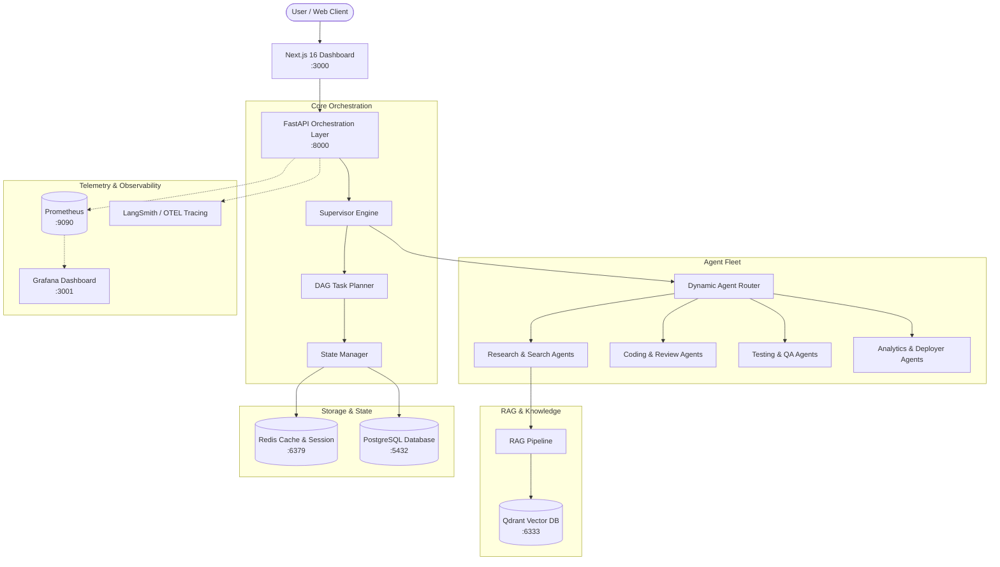

<!-- prettier-ignore -->
<div align="center">

# Multi-Agent System

*A production-grade autonomous multi-agent platform with dynamic DAG task planning, RAG pipeline, real-time observability, and a Next.js dashboard.*

[](https://www.python.org)
[](https://fastapi.tiangolo.com)
[](https://nextjs.org)
[](https://react.dev)
[](https://www.langchain.com)
[](https://www.postgresql.org)
[](https://redis.io)
[](https://qdrant.tech)
[](https://www.docker.com)

⭐ If you like this project, star it on GitHub!

[Overview](#overview) • [Architecture](#architecture) • [Features](#key-features) • [Quick Start](#quick-start) • [Agent Registry](#agent-registry) • [Configuration](#configuration) • [API Reference](#api-reference) • [Documentation](#documentation)

</div>

---

**Multi-Agent System** is an enterprise-ready AI orchestration platform. It breaks down complex user requests into dependency-aware Directed Acyclic Graph (DAG) tasks, coordinates a fleet of specialized domain agents, manages multi-tiered memory (Redis, PostgreSQL, Qdrant), and delivers verifiable answers with built-in reflection loops and hallucination detection.

> [!TIP]
> You can spin up the full production stack—including the Next.js telemetry dashboard, FastAPI supervisor, databases, and vector stores—with a single command: `docker compose up -d --build`.

---

## Overview

Modern generative AI applications frequently struggle with single-prompt bottlenecks, cascading hallucinations, and uncoordinated tool usage. **Multi-Agent System** solves this through hierarchical multi-agent orchestration:

1. **Supervisor & Task Decomposition**: Analyzes requests, decomposes goals into discrete tasks, and models their execution order as a dependency graph.
2. **Parallel Agent Dispatch**: Executes non-dependent tasks concurrently across specialized domain agents (planners, coders, researchers, testers, analysts, and QA checkers).
3. **Retrieval-Augmented Generation (RAG)**: Integrates vector-backed document ingestion and semantic search across PDF, Markdown, TXT, and DOCX formats.
4. **Hybrid Memory Store**: Employs Redis for real-time conversation and short-term execution caching, PostgreSQL for persistent audit trails, and Qdrant for semantic vector memories.
5. **Quality Verification**: Executes reflection loops and hallucination checks prior to response finalization.

---

## Architecture



### Component Highlights

- **`Supervisor`**: Orchestrates execution lifecycles, manages concurrency, handles exponential backoff retries, and coordinates quality assurance loops.
- **`Router` & `BaseAgent`**: Modular agent registry where every agent encapsulates system prompts, domain-specific tools, and asynchronous execution routines.
- **`RAGPipeline`**: Standalone document ingestion and retrieval engine supporting chunking, dense vector embeddings, and similarity ranking.
- **`StateManager` & `MemoryManager`**: Unified state abstraction decoupling storage backends from business logic.
- **Next.js Dashboard**: Dark-mode UI featuring live DAG execution inspection, multi-turn conversational playground, agent registry viewer, and memory telemetry.

---

## Key Features

- **Dynamic DAG Planning**: Generates dependency graphs with topological task sorting, maximizing parallel throughput.
- **10+ Specialized Agents**: Dedicated personas for Planning, Web Research, Document Retrieval, Architecture Design, Coding, Code Review, Debugging, Unit Testing, QA Validation, Data Analytics, and DevOps.
- **Multi-Provider LLM Support**: First-class integration with **Groq**, **OpenRouter**, **OpenAI**, and **Anthropic** with configurable fallback and model overrides.
- **Independent RAG Subsystem**: Multi-format document parser (`.pdf`, `.md`, `.txt`, `.docx`), recursive chunking, and Qdrant vector retrieval.
- **3-Tier Hybrid Memory**:
  - *Short-Term*: Redis for low-latency session dialogues and active task states.
  - *Long-Term*: PostgreSQL for persistent executions, agent states, and metrics.
  - *Semantic*: Qdrant vector index for cross-session semantic search and knowledge retrieval.
- **Enterprise Observability**: Native Prometheus metrics exporter, OpenTelemetry (OTEL) traces, LangSmith debugging, and structured JSON logging.
- **Modern Next.js Dashboard**: Reactive interface built with Next.js 16, React 19, Tailwind CSS, and Framer Motion.

---

## Quick Start

### Prerequisites

- [Docker](https://docs.docker.com/get-docker/) & [Docker Compose](https://docs.docker.com/compose/) *(Recommended)*
- Or [Python 3.10–3.12](https://www.python.org/downloads/) & [Node.js 20+](https://nodejs.org/) for manual installation.
- An API Key for your chosen LLM provider (Groq, OpenRouter, OpenAI, or Anthropic).

---

### Option A: Run with Docker Compose (Recommended)

1. **Clone the repository:**
   ```bash
   git clone https://github.com/your-org/multi-agent-system.git
   cd multi-agent-system
   ```

2. **Configure environment variables:**
   ```bash
   cp .env.example .env
   ```
   Edit `.env` to provide your LLM API keys:
   ```dotenv
   DEFAULT_LLM_PROVIDER=groq
   GROQ_API_KEY=your_groq_api_key
   # Or configure OpenAI / OpenRouter / Anthropic
   ```

3. **Start the complete stack:**
   ```bash
   docker compose up -d --build
   ```

4. **Access the services:**

   | Service | URL | Purpose |
   | :--- | :--- | :--- |
   | **Frontend Dashboard** | [http://localhost:3000](http://localhost:3000) | Web UI, DAG visualizer & chat playground |
   | **FastAPI Swagger Docs** | [http://localhost:8000/api/docs](http://localhost:8000/api/docs) | Interactive API documentation |
   | **API Health Check** | [http://localhost:8000/health](http://localhost:8000/health) | Service health and version status |
   | **Qdrant Dashboard** | [http://localhost:6333/dashboard](http://localhost:6333/dashboard) | Vector database collection manager |

> [!NOTE]
> For live development with hot reloading on both backend and frontend, run:
> ```bash
> docker compose --profile dev up --build
> ```

---

### Option B: Local Manual Setup

#### 1. Backend Service

```bash
# Create and activate a Python virtual environment
python3 -m venv .venv
source .venv/bin/activate

# Install dependencies
pip install -r requirements.txt

# Configure environment
cp .env.example .env

# Run FastAPI backend
uvicorn multi_agent_system.api.main:app --reload --host 0.0.0.0 --port 8000
```

> [!IMPORTANT]
> Ensure local instances of Redis (`localhost:6379`), PostgreSQL (`localhost:5432`), and Qdrant (`localhost:6333`) are running.

#### 2. Frontend Application

```bash
cd frontend
npm install
npm run dev
```
Open [http://localhost:3000](http://localhost:3000) in your browser.

---

## Agent Registry

The platform comes pre-configured with specialized agents grouped by capability domain:

| Domain | Agent ID | Persona & Responsibility | Built-in Tools / Capabilities |
| :--- | :--- | :--- | :--- |
| **Orchestration** | `supervisor` | Coordinates execution, enforces retries, approves output | `orchestration`, `coordination`, `reflection` |
| **Planning** | `planner` | Decomposes requests into dependency task graphs | `task_breakdown`, `dependency_analysis` |
| **Research** | `searcher` | Conducts live web research | `web_search`, `duckduckgo` |
| **Research** | `retriever` | Queries knowledge base and vector collections | `vector_search`, `rag`, `semantic_search` |
| **Research** | `summarizer` | Synthesizes and distills multi-source findings | `summarization`, `synthesis` |
| **Engineering** | `architect` | Designs system architecture and tech specifications | `system_design`, `tech_stack_selection` |
| **Engineering** | `developer` | Implements, refactors, and generates code | `python`, `filesystem`, `git` |
| **Engineering** | `reviewer` | Audits code for patterns, security, and quality | `code_review`, `quality_assurance` |
| **Engineering** | `debugger` | Diagnoses runtime exceptions and proposes patches | `error_analysis`, `fix_generation` |
| **Testing** | `unit_tester` | Writes and runs targeted unit tests | `python`, `pytest` |
| **Testing** | `integration_tester` | Validates end-to-end flows and API contracts | `api_testing`, `e2e_testing` |
| **Quality** | `logic_checker` | Verifies reasoning validity and consistency | `logic_validation`, `consistency_check` |
| **Quality** | `hallucination_detector` | Cross-checks facts against retrieved source context | `fact_checking`, `verification` |
| **Analytics** | `data_analyst` | Processes data tables and generates metrics | `python`, `pandas`, `sql` |
| **Analytics** | `visualizer` | Generates plots, charts, and visualizations | `matplotlib`, `plotly` |
| **DevOps** | `docker_agent` | Manages Dockerfiles, container setups, and compose | `docker`, `docker_compose` |
| **DevOps** | `kubernetes_agent` | Generates and manages Kubernetes manifests and Helm | `kubectl`, `helm` |
| **Documentation**| `documentation_writer`| Authors technical specifications and markdown guides | `technical_writing`, `markdown` |

---

## RAG & Knowledge Retrieval

The RAG pipeline operates independently from agents, allowing seamless reuse across different agent workflows:

```python
from multi_agent_system.configs.settings import settings
from multi_agent_system.rag.pipeline import RAGPipeline

# Initialize the pipeline with configured embedding and vector store backends
pipeline = RAGPipeline.from_settings(settings)

# Ingest documentation (supports .pdf, .md, .txt, .docx)
await pipeline.ingest(["docs/Architecture.md", "docs/API.md"])

# Perform semantic search
results = await pipeline.retrieve("How does the supervisor handle failed tasks?", top_k=3)
for chunk in results:
    print(f"[{chunk.source}] {chunk.content}\n")
```

---

## Configuration

All configuration is driven via environment variables defined in `.env`:

| Variable Category | Key Variables | Description |
| :--- | :--- | :--- |
| **LLM Provider** | `DEFAULT_LLM_PROVIDER` | Active provider: `groq`, `openrouter`, `openai`, or `anthropic` |
| | `DEFAULT_MODEL` | Default model identifier (e.g. `openai/gpt-oss-120b`, `gpt-4o-mini`) |
| | `GROQ_API_KEY` / `OPENROUTER_API_KEY` | Provider API authentication tokens |
| **Databases & Cache** | `POSTGRES_URL` | Async PostgreSQL connection string |
| | `REDIS_URL` | Redis URL for session memory and task lock caching |
| **Vector Store & RAG**| `QDRANT_URL` | HTTP endpoint for Qdrant vector database |
| | `RAG_COLLECTION_NAME` | Vector collection name for RAG documents |
| | `EMBEDDING_MODEL` | Embedding model (e.g. `text-embedding-3-small`) |
| | `EMBEDDING_DIMENSION` | Dimensionality of vectors (default: `1536`) |
| **Observability** | `STRUCTURED_LOGGING` | Format logs as structured JSON (`true`/`false`) |
| | `METRICS_ENABLED` | Expose Prometheus metrics endpoint (`true`/`false`) |
| | `OTEL_ENABLED` | Export OpenTelemetry traces (`true`/`false`) |
| | `LANGSMITH_TRACING` | Enable LangSmith tracing integration (`true`/`false`) |
| **Runtime Controls** | `MAX_PARALLEL_TASKS` | Max tasks executed concurrently in graph (default: `5`) |
| | `MAX_RETRIES` | Max retry attempts per failed agent task (default: `3`) |

> [!CAUTION]
> Never commit your production `.env` file or hardcoded API keys into version control. Use secret management services in production deployments.

---

## API Reference

### 1. Execute Multi-Agent Request

Submit a request for automated planning and multi-agent execution:

```bash
curl -X POST http://localhost:8000/api/v1/execute \
  -H "Content-Type: application/json" \
  -d '{
    "message": "Design and implement a rate-limiting middleware in Python with unit tests.",
    "enable_reflection": true,
    "enable_qa": true
  }'
```

**Response (`200 OK`):**
```json
{
  "execution_id": "9f3f4c6e-82d1-4bb2-b5e1-897ea4f9c112",
  "response": "### Architecture Design\n...",
  "execution_time": 4.82,
  "tasks_completed": 4,
  "total_cost": 0.0018,
  "total_tokens": 3420,
  "confidence": 0.95
}
```

### 2. Inspect Execution Status

Query the real-time progress and DAG state of an ongoing or completed task:

```bash
curl http://localhost:8000/api/v1/execution/9f3f4c6e-82d1-4bb2-b5e1-897ea4f9c112
```

### 3. List Available Agents

Retrieve the runtime registry of available agent profiles:

```bash
curl http://localhost:8000/api/v1/agents
```

### 4. Health Check

```bash
curl http://localhost:8000/health
```

---

## Observability & Telemetry

The platform includes built-in observability capabilities:

- **Prometheus Metrics**: Available at `/metrics/prometheus` or via API at `/api/v1/metrics`. Scrapes token counts, execution latencies, agent invocation counts, and error rates.
- **Grafana Dashboards**: Pre-packaged Prometheus and Grafana stack located in `docker/docker-compose.yml`:
  ```bash
  docker compose -f docker/docker-compose.yml up -d
  ```
  Access Grafana at [http://localhost:3001](http://localhost:3001) (`admin` / `admin`).
- **OpenTelemetry & LangSmith**: Set `OTEL_ENABLED=true` or `LANGSMITH_TRACING=true` in `.env` to stream distributed traces to your APM collector or LangSmith project.

---

## Development & Testing

Run unit and integration test suites using `pytest`:

```bash
# Run all tests
pytest

# Run tests with verbose output
pytest -v

# Run RAG pipeline tests
pytest tests/test_rag_pipeline.py
```

Code formatting and linting:

```bash
# Format code
black .

# Lint code
ruff check .
```

---

## Documentation

For in-depth architectural guides and extension documentation, refer to:

- [System Architecture](docs/Architecture.md) — Comprehensive design and component interaction.
- [Agent Framework](docs/Agents.md) — How to author and register custom agents.
- [Supervisor & DAG Engine](docs/Supervisor.md) — Task decomposition, graph execution, and retry semantics.
- [Memory System](docs/Memory.md) — Multi-tier state persistence across Redis, Postgres, and Qdrant.
- [RAG Subsystem](docs/RAG.md) — Document ingestion, custom embeddings, and vector index configuration.
- [REST API Reference](docs/API.md) — Complete endpoint documentation and request/response schemas.
- [Observability Guide](docs/Observability.md) — Prometheus, Grafana, OpenTelemetry, and LangSmith setup.
- [Deployment Guide](docs/Deployment.md) — Production hardening, TLS, scaling, and cloud deployment.
- [Docker Orchestration](docker/README.md) — Multi-container profiles, volume management, and health checks.
