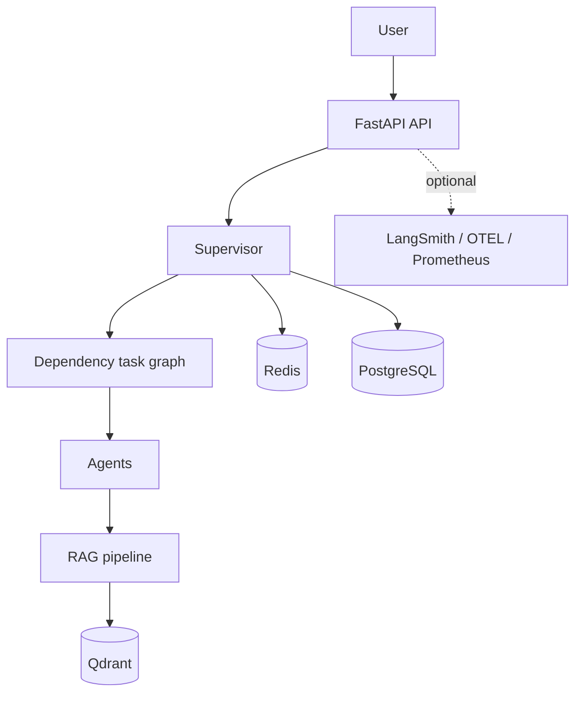

# Multi-Agent System

A production-oriented multi-agent platform built with FastAPI, LangChain, Redis, PostgreSQL, and Qdrant. A supervisor plans work, dispatches specialised agents, tracks state, and returns a validated response.

## Project overview



The supervisor creates a dependency plan and uses the router to select specialised agents. Redis stores short-lived state and conversations; Qdrant stores semantic memory and RAG documents; PostgreSQL is the long-term persistence target. See [Architecture](docs/Architecture.md).

## Installation and running locally

Requires Python 3.10–3.12, Docker (optional), and an OpenAI or Anthropic API key.

```bash
python3 -m venv .venv
source .venv/bin/activate
pip install -r requirements.txt
cp .env.example .env
uvicorn multi_agent_system.api.main:app --reload
```

Set `OPENAI_API_KEY` (or configure Anthropic) in `.env`; also start Redis, PostgreSQL, and Qdrant for local development. The API runs at `http://localhost:8000` and OpenAPI is at `/api/docs`.

## Docker setup

Run the complete multi-agent platform (Next.js Frontend, FastAPI Backend, PostgreSQL, Redis, and Qdrant) with Docker Compose:

```bash
# 1. Copy environment template and configure LLM API keys
cp .env.example .env

# 2. Start the production stack
docker compose up -d --build
```

### Endpoints
- **Frontend Dashboard:** [http://localhost:3000](http://localhost:3000)
- **FastAPI OpenAPI Docs:** [http://localhost:8000/api/docs](http://localhost:8000/api/docs)
- **Health Check:** [http://localhost:8000/health](http://localhost:8000/health)
- **Qdrant Vector DB:** [http://localhost:6333/dashboard](http://localhost:6333/dashboard)

### Development Mode (with hot reloading)
```bash
docker compose --profile dev up --build
```

For advanced configurations, Prometheus/Grafana observability, and volume management, see the [Docker Guide](docker/README.md).


## Configuration and environment variables

All settings are environment variables and are listed in `.env.example`.

| Area | Important settings |
| --- | --- |
| LLM | `OPENAI_API_KEY`, `DEFAULT_LLM_PROVIDER`, `DEFAULT_MODEL` |
| Storage | `POSTGRES_URL`, `REDIS_URL`, `QDRANT_URL` |
| RAG | `RAG_COLLECTION_NAME`, `EMBEDDING_MODEL`, `EMBEDDING_DIMENSION`, `CHUNK_SIZE` |
| Observability | `LANGSMITH_TRACING`, `OTEL_ENABLED`, `METRICS_ENABLED`, `STRUCTURED_LOGGING` |
| Runtime | `ENVIRONMENT`, `DEBUG`, `MAX_PARALLEL_TASKS`, `MAX_RETRIES` |

Use a secret manager for API keys and `SECRET_KEY` in production.

## Agent architecture

`Supervisor` builds a plan and executes ready graph tasks concurrently. `Router` selects configured agents; each inherits `BaseAgent`, owns its tools, and has an async `execute` method. Execution state is accessed through `StateManager`. Read [Agents](docs/Agents.md) and [Supervisor](docs/Supervisor.md).

## RAG pipeline

The independent `rag/` package loads PDF, Markdown, TXT, and DOCX; chunks document text; embeds it using the configurable OpenAI-default provider; stores vectors in Qdrant; retrieves chunks; and returns source-labelled context. Agents depend on `RAGPipeline`, not a specific vector database.

```python
pipeline = RAGPipeline.from_settings(settings)
await pipeline.ingest(["knowledge/guide.md"])
result = await pipeline.retrieve("What does the supervisor do?")
```

See [RAG](docs/RAG.md) for extension guidance.

## Memory architecture

Redis holds conversation and execution state, Qdrant holds vector collections, and PostgreSQL is reserved for durable state. Read [Memory](docs/Memory.md).

## Folder structure

`agents/` specialised agents; `api/` HTTP application; `configs/` settings; `graph/` task graph; `memory/` memory; `rag/` retrieval; `state/` execution state; `supervisor/` orchestration; `utils/` telemetry; `docs/` documentation; and `tests/` unit tests.

## Examples

```bash
curl -X POST http://localhost:8000/api/v1/execute -H 'content-type: application/json' \
  -d '{"message":"Research and summarize our indexed documentation."}'
```

Check health with `curl http://localhost:8000/health`; Prometheus metrics are at `/metrics/prometheus` when enabled.

## Development guide

Run `pytest`, `black .`, and `ruff check .`. New infrastructure should use existing interfaces, include type hints/docstrings, and use injected fakes in tests instead of network services.

## Deployment guide

Use `docker compose up -d` for a single-host installation. Place the API behind TLS termination, restrict CORS, set `ENVIRONMENT=production`, use managed data services where appropriate, rotate secrets, and back up persistent volumes. Details: [Deployment](docs/Deployment.md).

## Troubleshooting

- **Startup failures:** verify `.env` and Redis, PostgreSQL, and Qdrant health.
- **Embedding failures:** check API key, model name, and vector dimension.
- **No RAG matches:** ingest documents and confirm `RAG_COLLECTION_NAME`.
- **Telemetry failures:** leave optional telemetry disabled until credentials/endpoints are ready.

## Future roadmap

- Complete PostgreSQL persistence models and migrations.
- Add authenticated document-upload ingestion and background jobs.
- Add tenant isolation, RBAC, and production rate limiting.
- Add evaluation datasets, retrieval reranking, and dashboards.

## Further documentation

- [Architecture](docs/Architecture.md)
- [Agents](docs/Agents.md)
- [Supervisor](docs/Supervisor.md)
- [Memory](docs/Memory.md)
- [RAG](docs/RAG.md)
- [API](docs/API.md)
- [Observability](docs/Observability.md)
