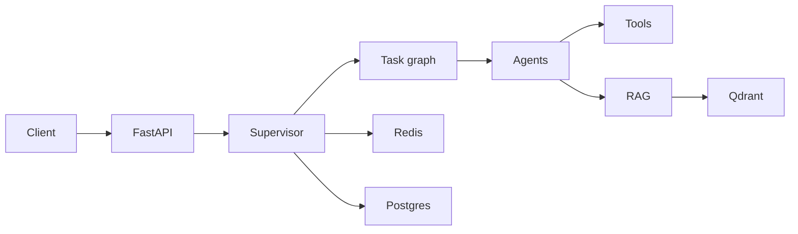

# Architecture

The API receives a request, the supervisor creates a task graph, and the router selects specialised agents. State is held in Redis for fast reads and designed for PostgreSQL persistence; conversation memory uses Redis and semantic knowledge uses Qdrant.

Components communicate through small interfaces: `BaseAgent`, `BaseTool`, `EmbeddingProvider`, and `VectorStore`. This keeps LLM providers and RAG backends replaceable.
