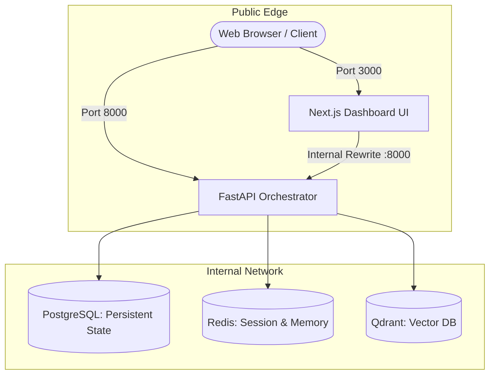

# Production Deployment Guide

This guide outlines how to deploy the Multi-Agent System stack in production and local staging environments.

---

## 1. Quick Start with Docker Compose

Deploy the complete multi-service platform (FastAPI Backend, Next.js Frontend, PostgreSQL, Redis, and Qdrant):

```bash
# 1. Clone repository and create environment file
cp .env.example .env

# 2. Fill in production secrets and API keys
# Set: OPENROUTER_API_KEY / OPENAI_API_KEY, POSTGRES_PASSWORD, etc.

# 3. Launch the containerized stack
docker compose up -d --build
```

---

## 2. Services Topology



---

## 3. Deployment Modes

### A. Production Mode (Default)
Optimized multi-stage containers with non-root security profiles, asset minification, and health checks:
```bash
docker compose up -d
```

### B. Development Mode (Autoreload)
Mounts source code directly from host for backend and frontend fast refresh:
```bash
docker compose --profile dev up --build
```

### C. Observability Stack (Prometheus + Grafana)
Enables Prometheus scraping and Grafana metrics visualization:
```bash
docker compose -f docker/docker-compose.yml up -d
```

---

## 4. Environment Variables Matrix

| Variable | Default | Purpose |
| :--- | :--- | :--- |
| `ENVIRONMENT` | `production` | Runtime mode (`production` / `development`) |
| `DEBUG` | `false` | Enable verbose debugging and wide CORS |
| `DEFAULT_LLM_PROVIDER` | `openrouter` | Provider (`openrouter`, `openai`, `anthropic`) |
| `DEFAULT_MODEL` | `nvidia/nemotron-3-ultra-550b-a55b:free` | Primary model for supervisor & agents |
| `OPENROUTER_API_KEY` | - | OpenRouter API Key |
| `OPENAI_API_KEY` | - | OpenAI API Key |
| `POSTGRES_USER` | `multi_agent` | PostgreSQL username |
| `POSTGRES_PASSWORD` | `multi_agent` | PostgreSQL password (change in production) |
| `POSTGRES_DB` | `multi_agent` | Database name |
| `REDIS_URL` | `redis://redis:6379/0` | Redis connection URL |
| `QDRANT_URL` | `http://qdrant:6333` | Qdrant vector database URL |
| `MAX_PARALLEL_TASKS`| `5` | Maximum concurrent DAG subtasks |

---

## 5. Production Hardening Checklist

- [ ] **TLS / SSL Termination:** Place a reverse proxy (e.g. Nginx, Traefik, or Cloudflare) in front of ports 3000 and 8000.
- [ ] **Restrict CORS:** Set `DEBUG=false` and restrict `allow_origins` in `api/main.py`.
- [ ] **Secrets Management:** Use Docker secrets, AWS Secrets Manager, or HashiCorp Vault instead of plaintext `.env`.
- [ ] **Persistent Volume Backups:** Back up named volumes (`postgres_data`, `redis_data`, `qdrant_data`) regularly.
- [ ] **Container User Security:** Both the backend API and Next.js frontend run as unprivileged non-root users (`app` and `nextjs`).

For further Docker Compose details, see [docker/README.md](file:///Users/karthikjayan/CascadeProjects/multi-agent-system/docker/README.md).

